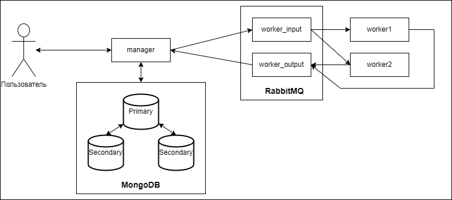

# Fault Tolerance

## Требования к системе:

Необходимо реализовать распределенную систему для взлома хэша под кодовым именем CrackHash. Непосредственно взлом хэша будет реализован через простой перебор словаря, сгенерированного на основе алфавита (brute-force). В общих чертах система должна работать по следующей логике:

1. В рамках системы существует менеджер, который принимает от пользователя запрос, содержащий MD-5 хэш некоторого слова, а также его максимальную длину.
2. Менеджер обрабатывает запрос, генерируя задачи в соответствии с заданным числом воркеров (вычислительных узлов) на перебор слов, составленных из переданного им алфавита. После чего отправляет их на исполнение воркерам.
3. Каждый воркер принимает задачу, перебирает слова в заданном диапазоне и вычисляет их хэш. Находит слова, у которых хэш совпадает с заданным, и результат работы возвращает менеджеру через очередь.

## Основные требования к отказоустойчивости:
1. Обеспечить сохранность данных при отказе работы менеджера:
   - Для этого необходимо обеспечить хранение данных об обрабатываемых запросах в базе данных.
   - Также необходимо организовать взаимодействие воркеров с менеджером через очередь RabbitMQ.
   - Если менеджер недоступен, то сообщения должны сохраняться в очереди до момента возобновления его работы.

2. Обеспечить частичную отказоустойчивость базы данных:
   - База данных также должна быть отказоустойчивой, для этого требуется реализовать простое реплицирование для нереляционной базы MongoDB.
   - Минимально рабочая схема одна primary нода, две secondary.
   - Менеджер должен отвечать клиенту, что задача принята в работу только после того, как она была успешно сохранена в базе данных и отреплицирована.

3. Обеспечить сохранность данных при отказе работы воркера(-ов):
   - В docker-compose необходимо разместить, как минимум, 2 воркера.
   - Организовать взаимодействие менеджера с воркерами через очередь RabbitMQ (вторая, отдельная очередь), аналогично настроить direct exchange.
   - В случае, если любой из воркеров при работе над задачей "сломался" и не отдал ответ, то задача должна быть переотправлена другому воркеру, для этого необходимо корректно настроить механизм acknowledgement-ов.
   - Если на момент создания задач нет доступных воркеров, то сообщения должны дождаться их появления в очереди, а затем отправлены на исполнение.

4. Обеспечить сохранность данных при отказе работы очереди:
   - Если менеджер не может отправить задачи в очередь, то он должен сохранить их у себя в базе данных до момента восстановления доступности очереди, после чего снова отправить накопившиеся задачи.
   - Очередь не должна терять сообщения при рестарте (или падении из-за ошибки), для этого все сообщения должны быть персистентными (это регулируется при их отправке).

## Кейсы, которые будут проверяться:
1. Стоп сервиса менеджера в docker-compose:
   - Полученные ранее ответы от воркеров должны быть сохранены в базе и не должны потеряться.
   - Не дошедшие до менеджера ответы на задачи не должны потеряться, менеджер должен подобрать их при рестарте.
2. Стоп primary ноды реплик-сета MongoDB в docker-compose:
   - Primary нода должна измениться, в системе продолжать работу в штатном режиме.
3. Стоп RabbitMQ в docker-compose:
   - Все необработанные, на момент выключения очереди, сообщения после рестарта не должны потеряться.
4. Стоп воркера во время обработки задачи:
   - Сообщение должно быть переотправлено другому воркеру, задача не должна быть потеряна.

## Тестирование:
    В manager реализовать end-point для следующего json: {"hash": String, "maxLength": int, "numCase": int}, где numCase - номер кейса, и он должно корректно отработать.

# Стек
- Java 17
- Gradle
- Spring Boot
- RabbitMQ
- MongoDB
- Docker API

## Схема:

## Запуск:

### Сборка воркера:
    cd worker
    gradle build

### Сборка менджера:
    cd manager
    gradle build

## Запуск системы:
    docker-compose up

## Пример запросов:

### Взлом хэша:
    curl -X POST -H "Content-Type: application/json" -d '{"hash":"b735b0c78e12553e91397a3ff19f8fd1", "maxLength": 3}' localhost:8080/api/hash/crack

### Статус взлома хэша:  
    curl http://localhost:8080/api/hash/status?requestId=requestId

### Тестирование кэйсов:  
    curl -X POST -H "Content-Type: application/json" -d '{"hash":"eeafbf4d9b3957b139da7b7f2e7f2d4a", "maxLength": 4, "numCase": 4}' localhost:8080/internal/api/manager/hash/crack/request/case

